# OpenGL project
 Created a 3D engine using OpenGL

## Contents

1. Compilation and execution
2. Pictures
3. Controls

## Compilation

> If you want to compile it by yourself

Requirements
```
sudo apt-get update
sudo apt-get install libglu1-mesa-dev freeglut3-dev mesa-common-dev
sudo apt-get install libgtk-3-dev
```

GCC
```
gcc *.c -lGL -lGLU -lglut -lm `pkg-config --libs --cflags gtk+-3.0` -lpthread -rdynamic -o output
```

> Otherwise

Execution

```
./output
```

## Pictures

### GUI

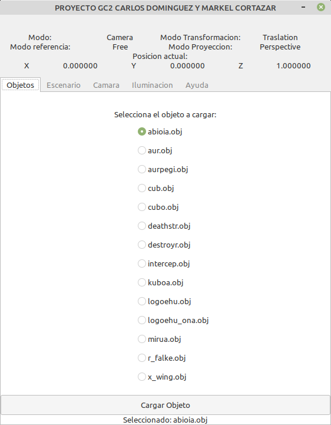

> Adding a new object to the scene.

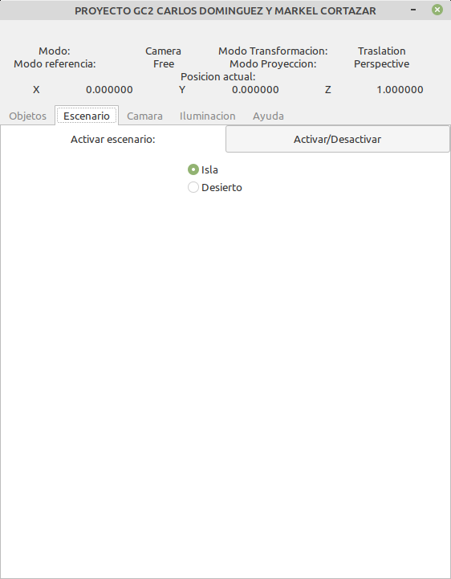

> Changing the static scenary

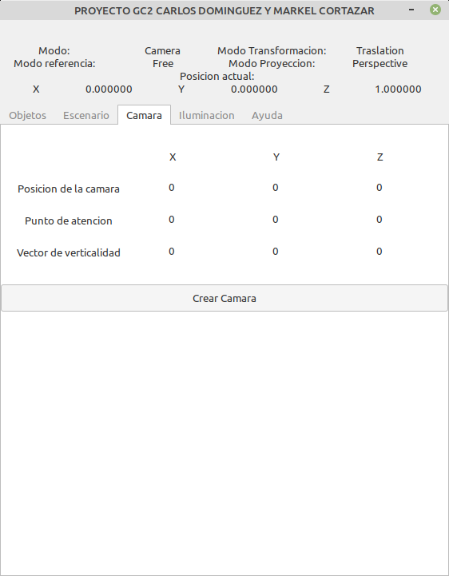

> Create a new Camera.

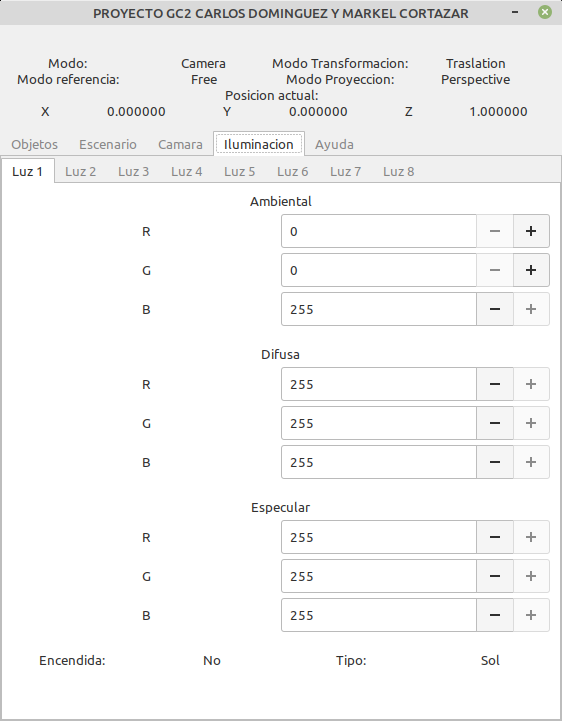

> Changing the ilumination.

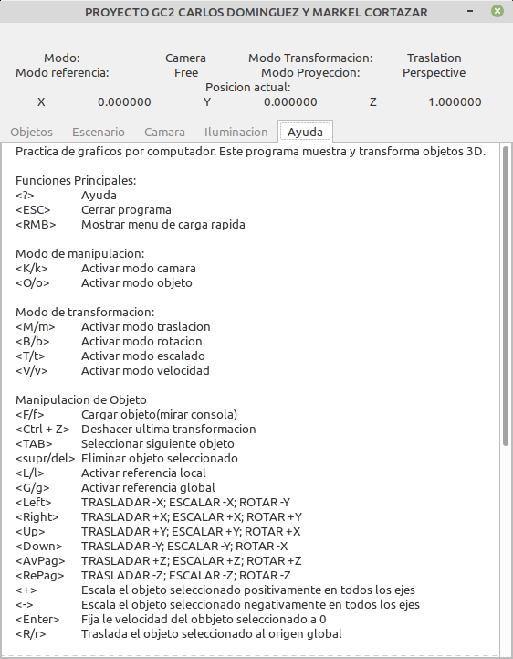

> Help (Spanish) English translation in GitHub (https://github.com/Xovesh/OpenGL-project).

### Without ilumination

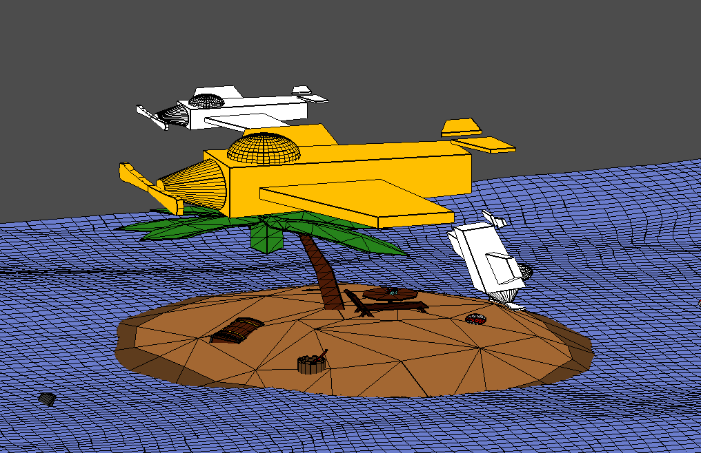

> General scene with some objects (Orange selected object) (Using wireframe and solid renderization).

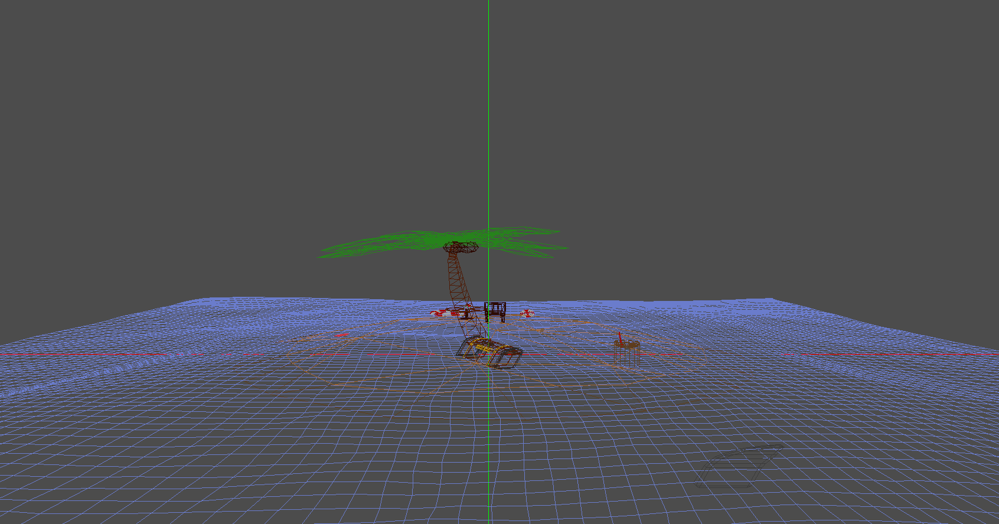

> General scene using only wireframe renderization.

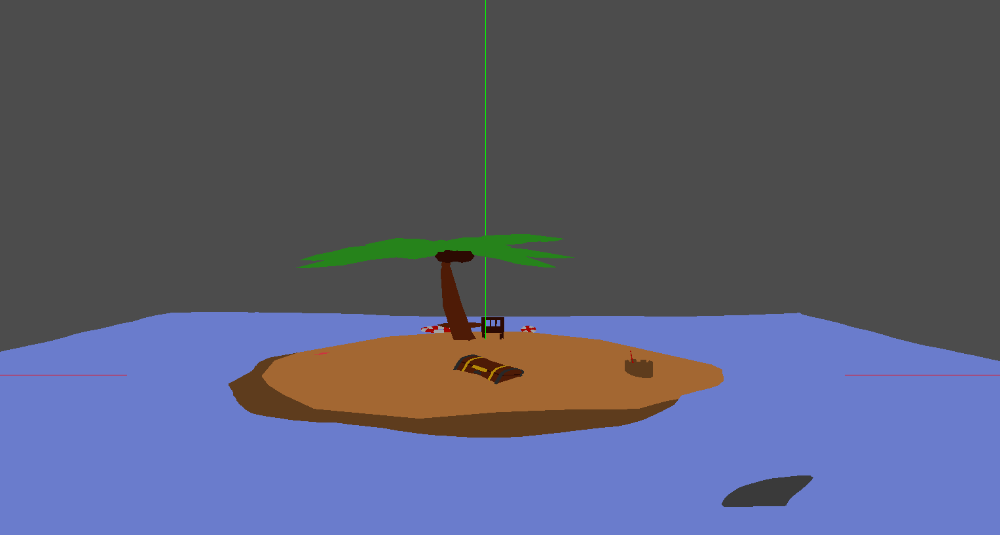

> General scene using only solid renderization.

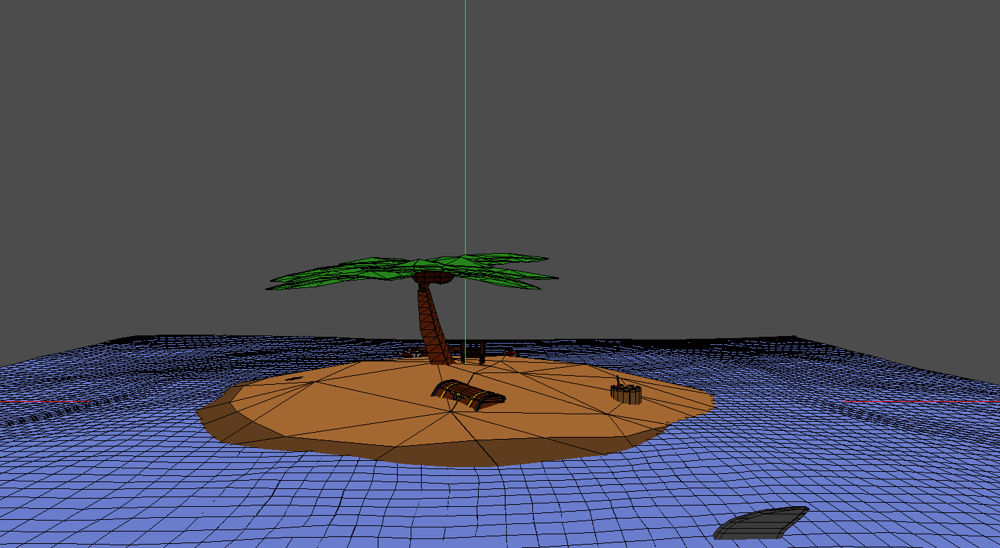

> General scene using solid and wireframe renderization.

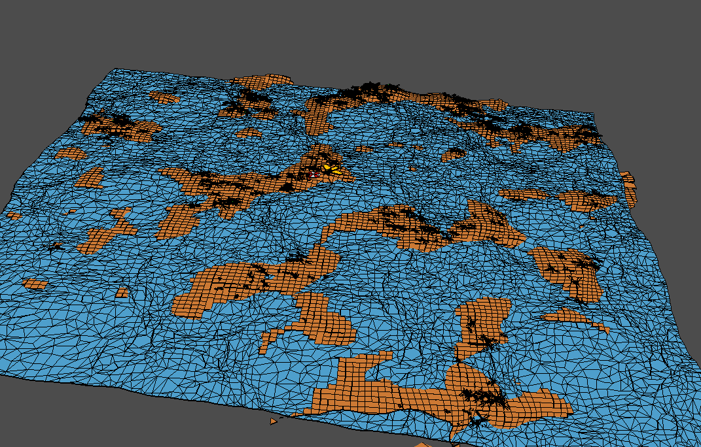

> Scene with 120k polygons.

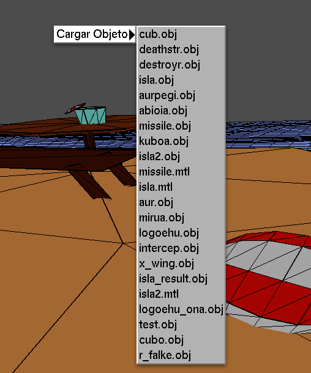

> Menu to charge and object fast (RMB).

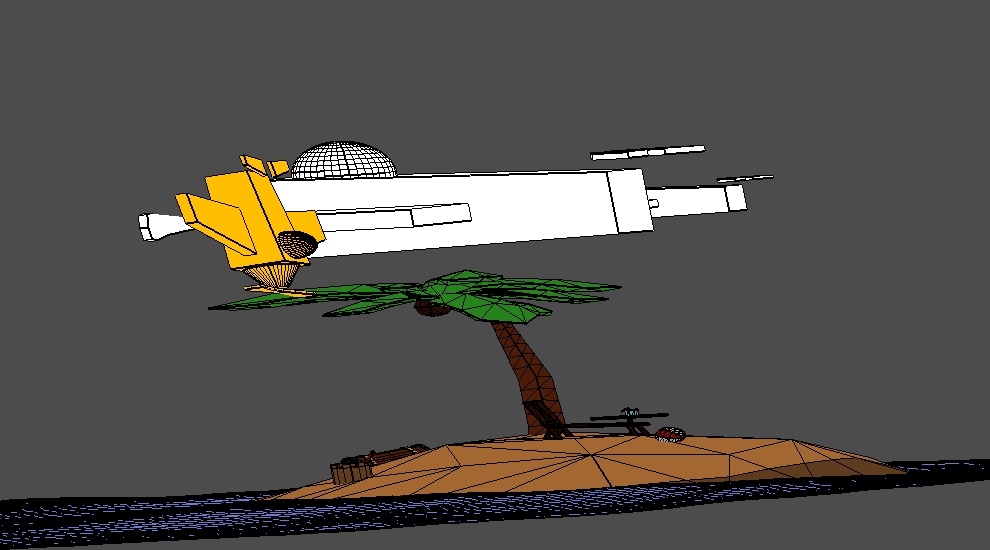

> Scene with objects in different position, rotated and different scale.

### With ilumination

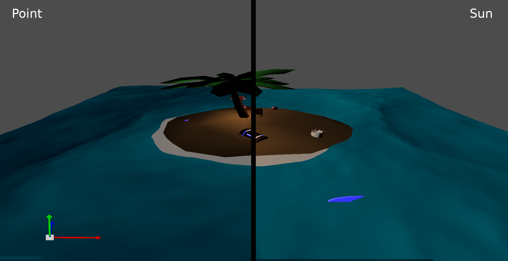

> Comparison between sun and point(bulb) lights.

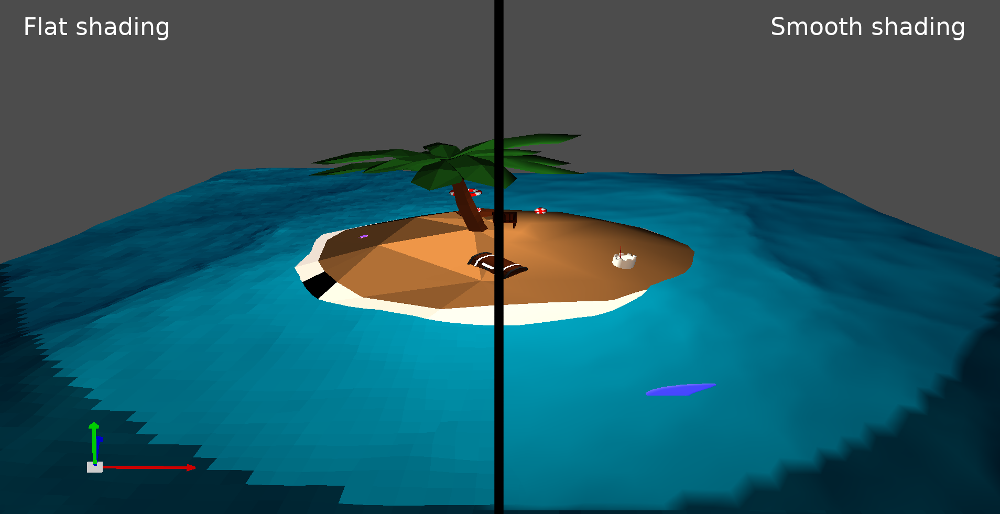

> Comparison between flat and smooth shading.

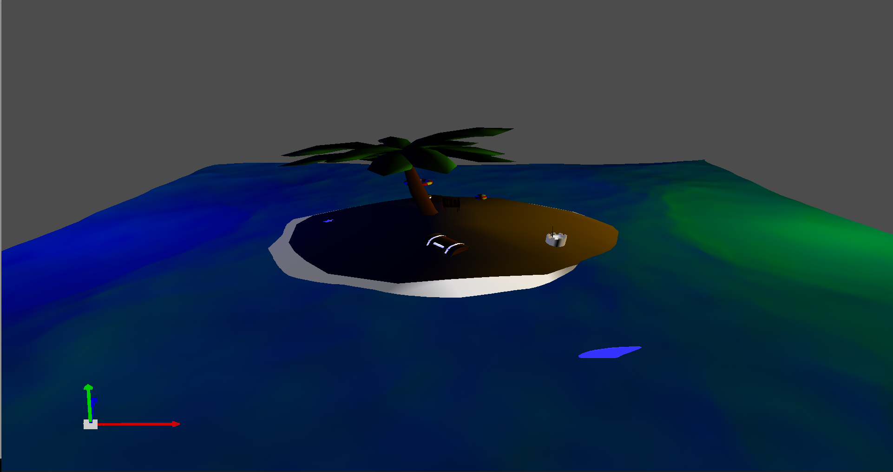

> Using two lights (Different diffuse color).

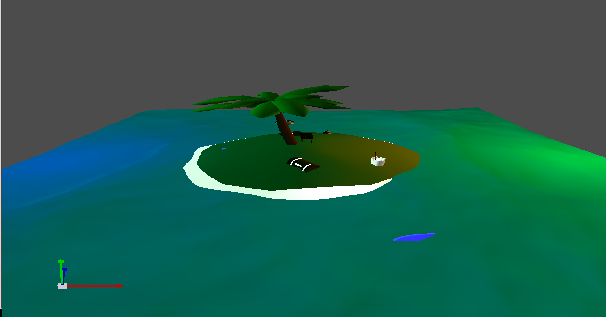

> Using two suns (Different diffuse color).

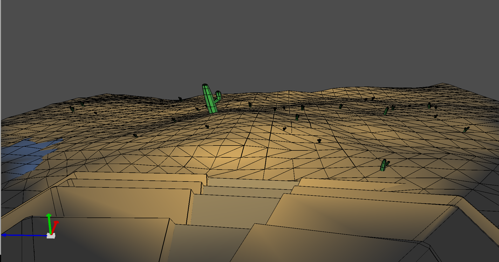

> Desert scene using camera sportlight.

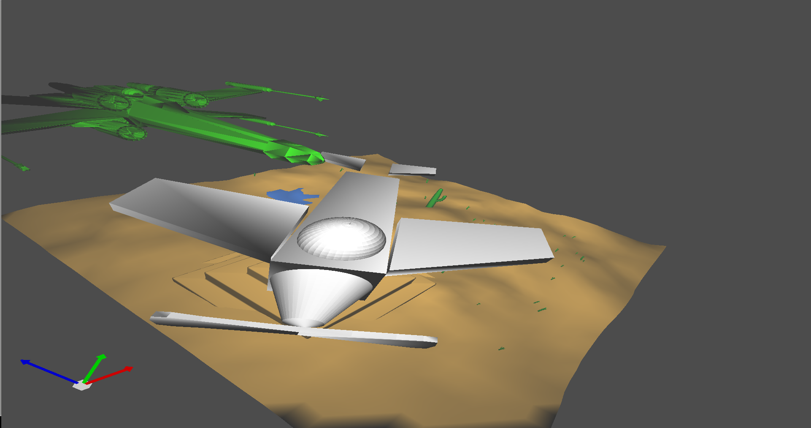

> Scene with some objects using lights.

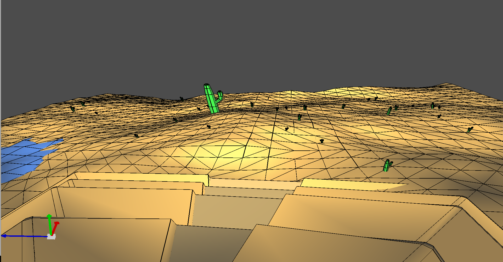

> Desert scene using a sun and a spotlight.

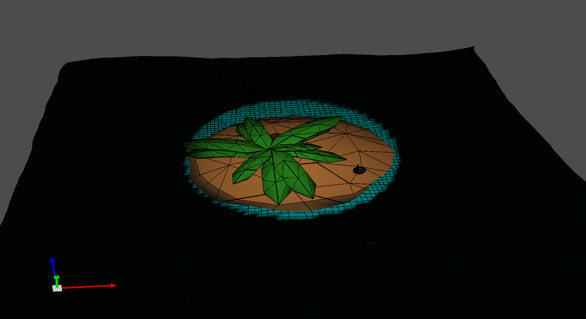

> Camera spotlight with reduce opening angle.


## Controls